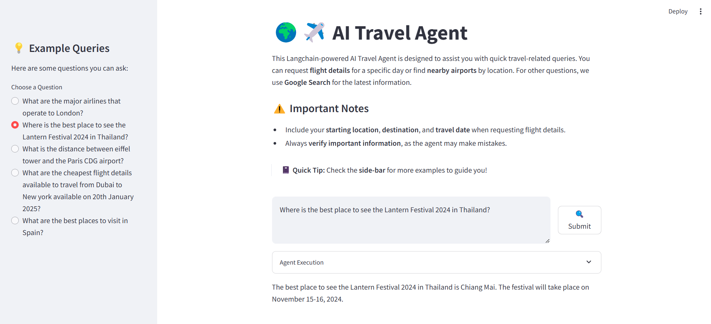

# Deploying Local LLM agent on AIPC

## Introduction
This section of AIPC Samples showcases how to deploy local LLM agents using the Langchain tools on Intel® Core™ Ultra Processors. The aim is to deploy an Agent on the iGPU (integrated GPU) of the AIPC. For this, Llamacpp GPU backend for SYCL is setup and the agent created using the local LLM model. The agent makes use of langchain toolkits and tools for user queries. 

### Table of Contents
1. AI Travel Agent Workflow
2. Installing Prerequisites
   - Windows
   - Linux
3. Setting up environment and LlamaCPP-python GPU backend
4. Sample execution on the AIPC GPU

### AI Travel Agent Workflow


## Installing Prerequisites
The following software are to be installed prior to the setting up of Llamacpp-python SYCL backend
1. GPU Drivers 
2. CMake
3. Microsoft Visual Studio 2022 community version 
4. Microsoft Visual Studio Code
5. OneAPI Basekit for Windows 
6. Miniconda for Windows
7. Git for Windows

### 1. GPU Drivers installation
-	Download and Install the GPU driver from Intel® Arc™ & Iris® Xe Graphics - Windows* [link](https://www.intel.com/content/www/us/en/download/785597/intel-arc-iris-xe-graphics-windows.html)
- (Optional) Download and Install the NPU driver from [here](https://www.intel.com/content/www/us/en/download/794734/intel-npu-driver-windows.html)
- For NPU, if the Neural processor is not available, Check the PCI device to update the driver.
  Follow this document [NPU_Win_Release_Notes_v2540.pdf](https://downloadmirror.intel.com/825735/NPU_Win_Release_Notes_v2540.pdf)

**IMPORTANT:** Reboot the system after the installation

### 2. CMake for windows 
Download and install the latest CMake for Windows from [here](https://cmake.org/download/)

### 3. Microsoft Visual Studio 2022 community version 
Download and install VS 2022 community from [here](https://visualstudio.microsoft.com/downloads/)  
\
**IMPORTANT:** Please select "Desktop Development with C++" option while installing Visual studio

### 4. Microsoft Visual Studio Code  
Download and install Microsoft Visual Studio Code from [here](https://code.visualstudio.com/Download)

### 5. OneAPI Basekit for Windows 
Download and install OneAPI Basekit for Windows from [here](https://www.intel.com/content/www/us/en/developer/tools/oneapi/base-toolkit-download.html?operatingsystem=windows&windows-install-type=offline)

### 6. Miniconda for Windows
Download and install Miniconda from [here](https://github.com/conda-forge/miniforge/releases/latest/download/Miniforge3-Windows-x86_64.exe)

### 7. Git for Windows
Download and install Git from [here](https://git-scm.com/downloads/win)

## Setting up environment and LlamaCPP-python GPU backend

Open a new terminal as administrator (right-click the terminal icon and select 'Run as administrator') and perform the following steps:

1. **Create and activate the conda environment**
   ```
   conda create -n gpu_llmsycl python=3.11 -y
   conda activate gpu_llmsycl
   ```
2. **Initialize oneAPI environment**
   On Windows:
   ```
   @call "C:\Program Files (x86)\Intel\oneAPI\setvars.bat" intel64 --force
   ```
   On Linux:
   ```
   source /opt/intel/oneapi/setvars.sh --force
   ```
3. **Set the environment variables and install Llamacpp-Python bindings**
   On Windows:
   ```
   set CMAKE_GENERATOR=Ninja
   set CMAKE_C_COMPILER=cl
   set CMAKE_CXX_COMPILER=icx
   set CXX=icx
   set CC=cl
   set CMAKE_ARGS="-DGGML_SYCL=ON -DGGML_SYCL_F16=ON -DCMAKE_CXX_COMPILER=icx -DCMAKE_C_COMPILER=cl"
   pip install llama-cpp-python==0.3.1 -U --force --no-cache-dir --verbose
   ```
   On Linux:
   ```
   CMAKE_ARGS="-DGGML_SYCL=on -DCMAKE_C_COMPILER=icx -DCMAKE_CXX_COMPILER=icpx" pip install llama-cpp-python==0.3.1 -U --force --no-cache-dir --verbose
   ```
6. **Install the required pip packages**
   ```
   pip install -r requirements.txt
   ```
7. **Install a ipykernel to select the gpu_llmsycl environment**
   ```
   python -m ipykernel install --user --name=gpu_llmsycl
   ```
8. **Download the GGUF models under `./models` folder using huggingface-cli**
   ```
   huggingface-cli download bartowski/Meta-Llama-3.1-8B-Instruct-GGUF --include "Meta-Llama-3.1-8B-Instruct-Q4_K_S.gguf" --local-dir ./models
   huggingface-cli download bartowski/Qwen2.5-7B-Instruct-GGUF --include "Qwen2.5-7B-Instruct-Q4_K_S.gguf" --local-dir ./models
   ```
    - Syntax for downlading the other models
   ```
   huggingface-cli download <repo_id> <filename> --local-dir <directory>
   ```
9. **Create and copy the ([Amadeus toolkit](https://developers.amadeus.com/get-started/get-started-with-self-service-apis-335), [SerpAPI](https://serpapi.com/), [GoogleSearchAPIWrapper](https://serper.dev/)) secret API keys in .env file**

10. **Launch the Jupyter notebook using the below command**
    ```
    jupyter notebook
    ```
     - Open the [AI Travel Agent notebook file](./AI_Travel_Agent.ipynb) and [Agent using Custom tools notebook file](./LLM_Agent_with_custom_tools.ipynb) in the jupyter notebook, select the gpu_llmsycl kernel and run the code cells one by one in the notebook.
  
11. **Run the [AI Travel Agent streamlit file](./AI_Travel_Agent_streamlit.py) using the below command**
    ```
    streamlit run AI_Travel_Agent_streamlit.py
    ```
    
## Sample execution on the AIPC GPU
- [AI Travel Agent](./AI_Travel_Agent.ipynb)
- **Deploying on Streamlit**
  
  
